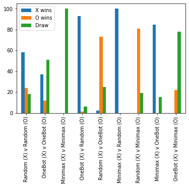

## CS420 - Assignment 2

#### Your goal
Change minimax.py file, such that the minimaxBot(...) function returns the best move in accordance with the minimax decision algorithm.

##### Test agents against yourself
You can test different bots against each other and against yourself.
To do this, in terminal run:

    python playTTT.py X-player O-player

where *X-player* and *O-player* are one of the following:
- H - for human player
- R - for randomBot (a dumb player that makes random moves)
- O - for oneBot (random unless it can win or block opponent from winning)
- M - for minimaxBox (this runs your code)

##### Test agents against each other in a batch
Use the ttt.ipynb jupyter notebook to test bots against each other in a batch and see the results as a table and a plot.

First thing you should do before running anything in the notebook is change `'YourNameHere'` to your actual name.

The code is already set up to test everything for you, BUT -
it may take a long time to run minimax games.

Thus, before you run the code as-is, you should first find the line that says
`GAMES = 100`
and maybe change it to `GAMES = 5`.
Five games is not enough to properly test the bots, but if the code runs without fail, at least you'll know that it *can* run, and it's not buggy.

Once you are satisfied that your code runs for five games, change it back to `GAMES = 100` and run the full simulation.

Final results should look something like this:

##### Files

- readme.py  - this file
- ttt.ipynb  - jupyter notebook for running and viewing results
- playTTT.py - code to play tic-tac-toe in console
- tttlib.py  - tic-tac-toe game engine
- players.py - code for human, randomBot, and oneBot players
- minimax.py - placeholder code -- replace it with your code for minimaxBot
- matchup-results-100.png - approximate results you are aiming for
- matchup-results-1000.png - results from 1000 games per matchup
